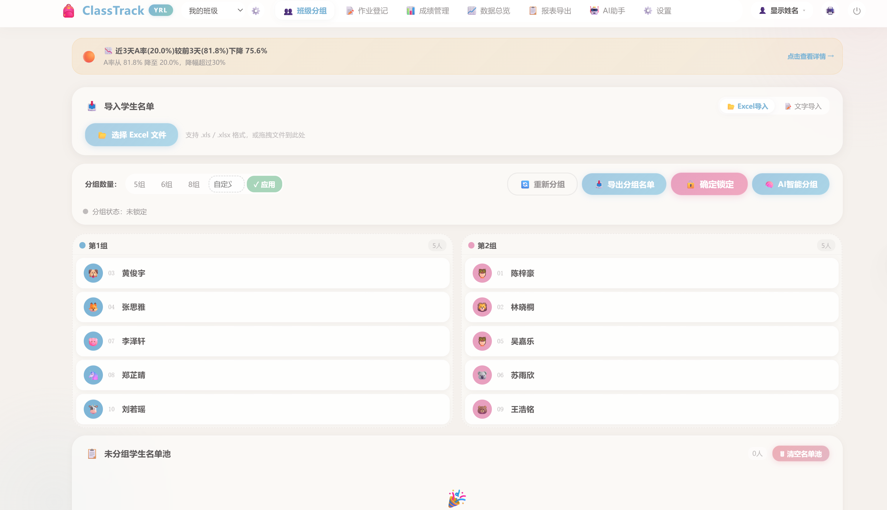
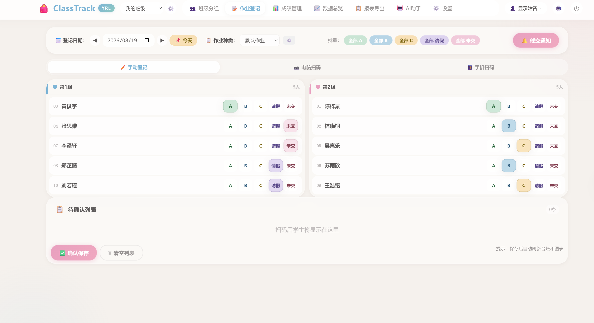
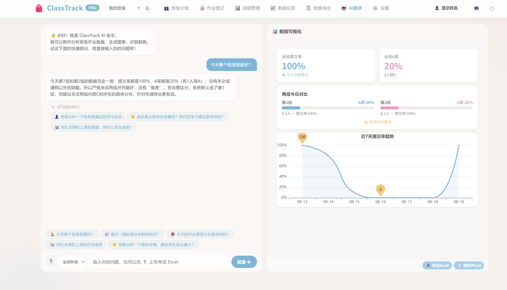
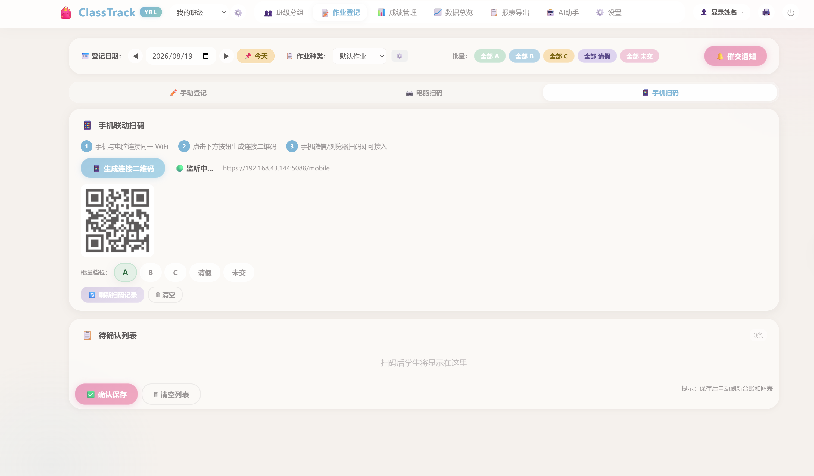
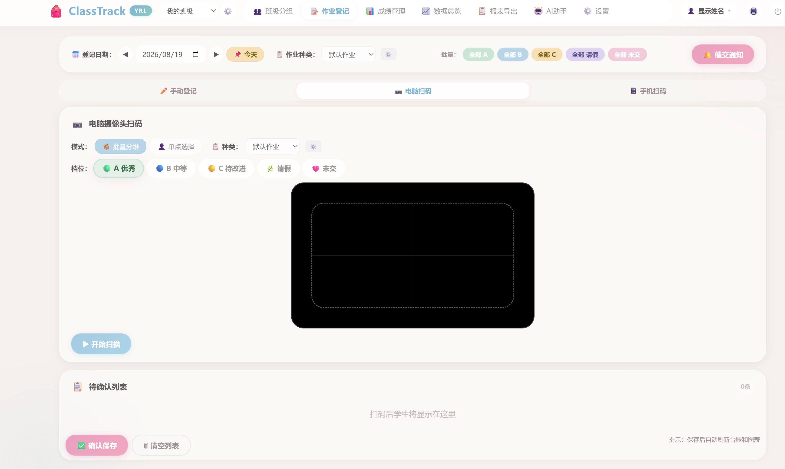
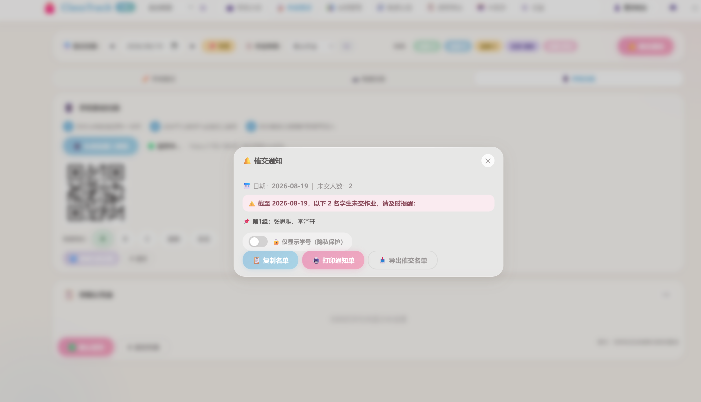

# ClassTrack - 班级作业分组管理系统

> [English](./README.en.md) | 中文

> 一款面向中小学教师的轻量级班级管理工具，支持学生导入、拖拽分组、作业等级登记、报表导出，以及 AI 智能助手。

---

## 🎬 演示视频

| 平台 | 链接 |
|------|------|
| 🇨🇳 **B站 (bilibili)** | [ClassTrack中小学老师登记作业神器](https://www.bilibili.com/video/BV1Hqgv6cExM) |
| 🌍 **YouTube** | 即将上线 |

> 视频涵盖：学生导入 → 拖拽分组 → 作业登记 → 报表导出 → AI 智能助手全流程演示

---

## 🖼️ 软件截图

### 核心功能

| 班级分组 | 作业登记 |
|---------|---------|
|  |  |

| AI 智能助手 | 手机扫码登记 |
|------------|-------------|
|  |  |

### 更多功能

| 电脑扫码 | 催交通知 | AI 评语生成 |
|---------|---------|------------|
|  |  |  |

---

## 目录

- [功能特性](#功能特性)
- [技术栈](#技术栈)
- [快速开始](#快速开始)
- [项目结构](#项目结构)
- [许可协议](#许可协议)
- [联系方式](#联系方式)

---

## 功能特性

### 核心功能

| 模块 | 说明 |
|------|------|
| 👥 **多班级管理** | 创建、切换、删除班级，独立数据隔离 |
| 📥 **学生导入** | 支持 Excel (.xls/.xlsx) 和纯文字导入，自动识别学号 |
| 🖱️ **拖拽分组** | 灵活分组、锁定、拖拽调整、颜色主题 |
| 📝 **作业登记** | A/B/C/请假/未交 五级评定，批量登记，日期导航 |
| 📊 **报表导出** | 单学生台账、全班汇总 Excel 导出 |
| 📈 **数据概览** | 统计卡片、饼图、柱状图、折线图、环比趋势 |
| 🏆 **小组排行榜** | A率排序、提交率、平均分 |
| ⚠️ **学生预警** | 连续未交、A率骤降智能预警 |
| 📱 **扫码登记** | 电脑摄像头 + 手机联动，二维码生成与打印 |
| 🔒 **隐私保护** | 姓名/学号分区显示模式 |

### AI 智能助手 (v2.0)

- 🤖 **AI 对话**：关键词意图识别 + LLM 数据驱动问答，支持 ECharts 可视化
- 📝 **AI 评语生成**：基于近30天数据生成个性化学生评语
- 🧠 **AI 智能分组**：蛇形均衡分配算法，基于作业表现自动分组
- 🔔 **智能预警横幅**：首页实时展示连续未交 / A率下降预警
- ⚙️ **多服务商支持**：DeepSeek / OpenAI / 通义千问 / 自定义

---

## 技术栈

| 层级 | 技术 |
|------|------|
| 后端 | Python 3.8+ / Flask / Waitress |
| 前端 | HTML5 / CSS3 / JavaScript / ECharts / Chart.js |
| 数据 | SQLite (本地文件数据库) |
| 打包 | PyInstaller (Windows 单文件 exe) |
| AI | OpenAI 兼容 API (DeepSeek / OpenAI / 通义千问) |
| 其他 | qrcode / pandas / openpyxl / pywebview |

---

## 快速开始

### 环境要求

- Windows 10/11
- Python 3.8 或以上
- Chrome / Edge / Firefox 浏览器

### 安装与运行

```bash
# 1. 克隆仓库
git clone https://github.com/ylin06326-glitch/-AI-Class-Assignment-Group-Management-System-with-AI-Assistant-.git
cd ClassTrack

# 2. 安装依赖
pip install -r requirements.txt

# 3. 启动
python main.py
```

启动后浏览器将自动打开 `https://localhost:5088`。

### 打包为 exe

```bash
pyinstaller ClassTrack.spec
```

打包产物在 `dist/` 目录下。

---

## 项目结构

```
ClassTrack/
├── main.py                  # 主程序入口（Flask 服务 + 路由）
├── app_paths.py             # 路径配置
├── requirements.txt         # Python 依赖
├── ClassTrack.spec          # PyInstaller 打包配置
├── build.bat                # 打包脚本
├── 启动ClassTrack.bat        # Windows 快捷启动
├── LICENSE                  # 许可协议
├── README.md                # 中文说明
├── README.en.md             # 英文说明
├── PROGRESS.md              # 开发进度追踪
├── 使用说明书.md             # 详细使用说明
├── docs/images/             # 软件截图
├── backend_server/          # 后端服务模块
├── static/                  # 静态资源 (CSS/JS/图片)
├── templates/               # HTML 模板
├── data/                    # 数据库文件 (运行时生成)
├── docs/                    # 文档
└── media/                   # 媒体资源
```

---

## 许可协议

本项目采用 **源码可用许可证（Source-Available License）**：

| 用途 | 是否允许 |
|------|----------|
| ✅ 个人学习、研究 | 免费 |
| ✅ 教育机构非盈利使用 | 免费 |
| ✅ 开源社区贡献与测试 | 免费 |
| ❌ 任何商业用途 | **必须事先联系作者获得授权** |

> 商业用途包括但不限于：将本软件集成到商业产品、用于商业服务、作为内部商业工具、销售副本或衍生作品等。

详见 [LICENSE](./LICENSE) 文件。

---

## 联系方式

- **作者**：杨润林 (YRL)
- 📧 **邮箱**：[ylin06326@gmail.com](mailto:ylin06326@gmail.com) / [yrl666hello@qq.com](mailto:yrl666hello@qq.com)
- **商业授权 / 合作**：欢迎邮件联系或 GitHub Issues
- **问题反馈**：欢迎提交 Issue

---

*ClassTrack - 让作业管理变得简单可爱 🎒*
